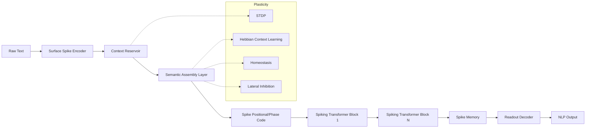
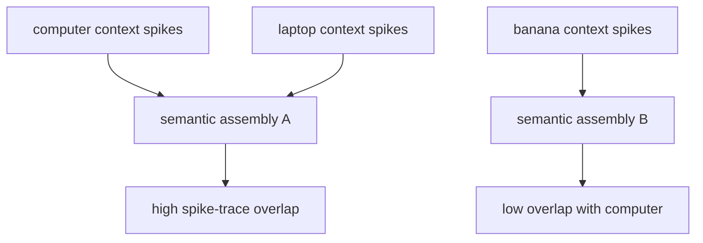

# Direct Semantic Spike Representations for Neuromorphic Language Processing

**A research-grade framework for replacing pretrained dense embeddings with emergent spike-based language representations**

Prepared: 2026-06-09  
Scope: Neuromorphic NLP, spiking neural networks, computational neuroscience, energy-efficient language modeling  
Core constraint: no BERT, GPT, Word2Vec, GloVe, FastText, sentence transformers, or pretrained dense embeddings.

---

## Abstract

Modern neuromorphic NLP often follows the pattern:

```text
Text -> pretrained dense embedding -> spike encoder -> SNN -> output
```

This design inherits most semantic structure from non-neuromorphic dense models, so it does not answer the central scientific question: can semantic representations emerge directly from spike-based language exposure?

This proposal introduces **Semantic Spike Language Transformer (SSLT)**, a framework that learns language representations from discrete linguistic events using spike timing, population coding, unsupervised plasticity, reservoir dynamics, and event-driven spiking attention. SSLT replaces dense embeddings with a trainable **Semantic Spike Encoder (SSE)** and replaces dot-product attention with **Spike Coincidence Attention (SCA)**, where attention is induced by temporal synchrony, eligibility traces, and sparse spike-gated synaptic routing.

The proposed system is designed for reproducible evaluation on AG News, IMDB, SST-2, and DBPedia using both task metrics and neuromorphic metrics: accuracy, F1, spike count, synaptic operations, energy estimate, latency, and spike sparsity.

---

## 1. Problem Statement

### 1.1 Motivation

Transformers achieve strong NLP performance but rely on dense matrix multiplication, large embedding tables, and high-memory attention. Neuromorphic systems promise event-driven sparse computation, but most current neuromorphic NLP pipelines still depend on dense pretrained semantic representations.

The key research question is:

> Can semantic similarity emerge directly from spike timing and spike population dynamics without any pretrained dense language model?

We seek a model in which:

```text
computer ~= laptop
king ~= queen
cat ~= dog
computer != banana
```

is reflected by spike train similarity, not by inherited vector-space similarity from a dense pretrained encoder.

### 1.2 Hypothesis

Semantic similarity can emerge from spike-based learning if the system jointly models:

1. **Distributional context**: words with similar contexts activate overlapping neural populations.
2. **Temporal binding**: temporally close linguistic events strengthen spike-timing associations.
3. **Population coding**: concepts are represented by sparse distributed spike ensembles.
4. **Synaptic plasticity**: STDP and Hebbian updates produce stable semantic attractors.
5. **Sparse routing**: attention emerges from spike coincidence rather than dense softmax.

---

## 2. Literature Analysis

### 2.1 Current State of Neuromorphic NLP

Neuromorphic NLP is younger than neuromorphic vision and speech. Current work can be grouped into five families:

1. **ANN-to-SNN conversion for text classification**  
   Early systems convert dense text classifiers into SNNs, often using pretrained word vectors or ANN activations as input.

2. **Spike encodings for NLP tasks**  
   Work such as SNNLP studies text-to-spike encoding schemes and shows that encoding quality strongly affects accuracy and energy estimates.

3. **Spiking BERT-style models**  
   SpikingBERT and SNN-BERT use BERT-like structures, implicit differentiation, surrogate gradients, or knowledge distillation to improve language understanding.

4. **Generative spiking language models**  
   SpikeGPT demonstrates large-scale spiking language modeling, but remains closer to deep sequence modeling with learned token embeddings than to biologically grounded semantic emergence.

5. **Spiking Transformers and spiking attention**  
   Spikformer, QKFormer, Spike-driven Transformer variants, and related architectures show that attention-like computation can be made sparse and spike-driven, mostly in vision settings.

### 2.2 Representative Papers

| Area | Representative Work | Main Contribution | Limitation for This Proposal |
|---|---|---|---|
| Spiking Transformer | Spikformer, ICLR 2023 | Spiking self-attention and spiking patch processing | Primarily vision; does not solve text semantics |
| Spiking LM | SpikeGPT, 2023 | Directly trained generative SNN language model | Uses token embeddings and deep supervised training |
| BERT-style SNN | SpikingBERT, AAAI 2024 | Distills BERT into spiking language model | Semantics inherited from dense teacher |
| Direct BERT-style SNN | SNN-BERT, Neural Networks 2024 | Direct training with bidirectional parallel spiking neurons | Still BERT-shaped and not focused on emergent spike semantics |
| Encoding study | SNNLP, 2024 | Compares spike-based NLP encodings | Encoding remains shallow and task-bound |
| Hardware LM | SpiNNaker 2 language modeling, 2024 | Neuromorphic hardware deployment for language modeling | Uses recurrent LM setup, not semantic spike emergence |
| Neuromorphic algorithms | Schuman et al., 2022 | Broad neuromorphic algorithm agenda | Does not solve NLP representation learning |

### 2.3 Limitations of Existing Systems

Current systems are limited by:

1. **Embedding dependence**: semantic structure is often imported from pretrained dense embeddings.
2. **Teacher dependence**: many strong spiking NLP results rely on BERT or ANN distillation.
3. **Weak biological plausibility**: backpropagation-through-time dominates training.
4. **Sparse hardware validation**: many energy claims are simulation estimates.
5. **Inconsistent metrics**: papers report accuracy but not spike count, synaptic operations, latency, and measured chip power together.
6. **Vision-first attention designs**: most spiking attention work is developed for image patches, not linguistic event streams.
7. **No standard semantic probe**: few papers test whether spike similarity itself encodes lexical or relational semantics.

### 2.4 Why Direct Semantic Spike Encoding Remains Unsolved

Direct semantic spike encoding is unsolved because language tokens are symbolic and discrete, while spikes are continuous temporal events. A simple character-to-spike or token-to-rate code preserves surface form but not meaning. A learned token embedding can recover meaning, but if trained as a dense lookup table it becomes an ordinary embedding layer rather than a neuromorphic representation.

The core unsolved challenge is to make meaning emerge from **spike timing statistics**:

```text
similar meaning -> similar contexts -> similar temporal co-activation -> overlapping neural assemblies
```

This requires a representation that is:

- local enough for neuromorphic hardware,
- plastic enough for semantic learning,
- sparse enough for energy efficiency,
- expressive enough for syntax and long-range context,
- trainable without importing pretrained dense semantics.

### 2.5 Sources

- Spikformer: <https://arxiv.org/abs/2209.15425>
- SpikeGPT: <https://arxiv.org/abs/2302.13939>
- QKFormer: <https://arxiv.org/abs/2403.16552>
- SNN-BERT: <https://www.sciencedirect.com/science/article/pii/S0893608024005549>
- SpikingBERT: <https://par.nsf.gov/servlets/purl/10496908>
- SNNLP: <https://arxiv.org/abs/2401.17911>
- Language Modeling on SpiNNaker 2: <https://arxiv.org/abs/2312.09084>
- Opportunities for Neuromorphic Computing Algorithms and Applications: <https://www.nature.com/articles/s43588-021-00184-y>
- Loihi on-chip learning context: <https://www.nature.com/articles/s41467-024-53927-6>

---

## 3. Proposed Contribution

This proposal introduces **SSLT: Semantic Spike Language Transformer**.

The novel contributions are:

1. **Semantic Spike Encoder without pretrained embeddings**  
   A family of encoders that map characters, morphemes, and self-organizing lexical assemblies into spike trains.

2. **Spike-native semantic emergence objective**  
   A training objective that aligns semantic similarity with spike train similarity using STDP, Hebbian co-activation, and context prediction.

3. **Spike Coincidence Attention**  
   An attention mechanism based on sparse temporal coincidence rather than dense dot-product softmax.

4. **Neuromorphic NLP benchmark protocol**  
   Evaluation combines NLP accuracy with spike count, synaptic operations, latency, energy estimate, and hardware readiness.

5. **Ablation suite for semantic emergence**  
   Probes test whether semantic structure exists in spike trains before task-specific decoding.

---

## 4. Mathematical Preliminaries

Let an input sequence be:

```text
x = (x_1, x_2, ..., x_L)
```

where each `x_i` may be a character, morpheme, subword, or word depending on the encoder.

A spike train for neuron `n` is:

```math
S_n(t) = \sum_f \delta(t - t_n^f)
```

where `t_n^f` is the firing time of the `f`-th spike.

For discrete simulation with timestep `t = 1...T`:

```math
s_n[t] \in \{0,1\}
```

A leaky integrate-and-fire neuron is:

```math
u_i[t+1] = \beta u_i[t] + \sum_j W_{ij}s_j[t] - \theta s_i[t]
```

```math
s_i[t+1] = H(u_i[t+1] - \theta)
```

where:

- `u_i[t]` is membrane potential,
- `W_ij` is synaptic weight,
- `beta = exp(-Delta t / tau_m)` is leak,
- `theta` is threshold,
- `H` is the Heaviside spike function.

For gradient training, use a surrogate derivative:

```math
\frac{\partial s_i}{\partial u_i} \approx \gamma \max(0, 1 - |u_i - \theta|)
```

---

## 5. Novel Semantic Spike Encoder

The framework supports three fundamentally different encoders.

---

### 5.1 Approach A: Character-Level Spike Encoding

#### Core Idea

Represent text as a sequence of character-triggered spike events. Semantic structure must emerge from compositional temporal patterns rather than predefined word vectors.

#### Biological Inspiration

This approach is inspired by:

- early sensory cortex feature detectors,
- temporal binding of sequential stimuli,
- cortical columns responding to recurring low-level patterns,
- local receptive fields for phonological and orthographic fragments.

#### Encoding

Let the character vocabulary be:

```math
\mathcal{C} = \{c_1, ..., c_V\}
```

Each character `c` is assigned a sparse population code:

```math
P(c) \subset \{1, ..., N_c\}
```

The spike input is:

```math
s_n[t] =
\begin{cases}
1, & n \in P(c_i) \text{ and } t = \alpha i + \epsilon_n \\
0, & \text{otherwise}
\end{cases}
```

where:

- `alpha` controls token duration,
- `epsilon_n` is deterministic jitter for temporal diversity,
- `P(c_i)` is a small active subset.

Optional latency code:

```math
t_n(c_i) = t_i + \lambda(1 - a_n(c_i))
```

where `a_n(c_i)` is a learned or hash-based affinity between character and neuron.

#### Complexity

For sequence length `L`, population size `k`, and timesteps per character `tau`:

```text
Encoding time: O(Lk)
Memory: O(N_c + Lk)
Spike density: k / N_c
```

#### Strengths

- No vocabulary bottleneck.
- Handles misspellings, morphology, rare words, and multilingual text.
- Biologically plausible sensory stream.
- Good for edge hardware because input events are sparse.

#### Weaknesses

- Long temporal horizon for sentence-level semantics.
- Semantic similarity is indirect.
- Requires strong recurrent or reservoir dynamics to bind characters into concepts.

---

### 5.2 Approach B: Morpheme/Subword Spike Encoding

#### Core Idea

Use a non-pretrained tokenizer to extract recurring morpheme-like units, then encode each unit as a sparse spiking assembly. This keeps the model neuromorphic while reducing sequence length.

Allowed tokenizers:

- byte-pair encoding trained from scratch,
- unigram language model tokenizer trained from scratch,
- rule-based morphological segmentation,
- byte-level segmentation.

Disallowed:

- pretrained BPE vocabulary from BERT, GPT, RoBERTa, etc.
- pretrained semantic embeddings.

#### Mathematical Formulation

Let the tokenizer produce:

```math
z = (z_1, ..., z_M), \quad z_i \in \mathcal{Z}
```

Each subword activates a sparse assembly:

```math
A(z_i) = \operatorname{TopK}(h(z_i), k)
```

where `h` is a deterministic hash or randomly initialized trainable assignment matrix.

The spike train is:

```math
s_n[t] = \mathbb{1}[n \in A(z_i)] \cdot \mathbb{1}[t_i \le t < t_i + \tau_i]
```

with optional burst coding:

```math
p(s_n[t]=1|z_i) = \sigma(\eta a_n(z_i) - \rho r_n[t])
```

where `r_n[t]` is refractory state.

#### Biological Inspiration

This resembles hierarchical auditory/language processing:

```text
features -> syllable-like units -> morphemes -> lexical assemblies
```

It also resembles cell assemblies in which recurring linguistic fragments recruit stable but sparse populations.

#### Complexity

If `M << L`:

```text
Encoding time: O(Mk)
Memory: O(|Z|k) if lookup-based, O(k) if hash-based
Spike density: k / N_z
```

#### Strengths

- More efficient than character-level encoding.
- Captures morphological regularities such as `un-`, `-ing`, `bio-`.
- Better for classification benchmarks.
- Still avoids pretrained dense semantics.

#### Weaknesses

- Subword units are not necessarily semantic.
- Tokenizer may overfit domain statistics.
- Morphological similarity can conflict with semantic similarity.

Example:

```text
king and queen are semantically close but morphologically distant.
computer and compute are morphologically close but context determines final semantic relation.
```

---

### 5.3 Approach C: Self-Organizing Semantic Spike Representations

#### Core Idea

This is the most novel approach. The model begins with surface-form spikes, then learns semantic assemblies through unsupervised context-driven plasticity.

Each lexical item becomes an attractor-like spiking assembly. Semantically related words activate overlapping assemblies because they occur in similar contexts.

#### System

The encoder has three layers:

```text
surface spike layer -> context reservoir -> semantic assembly layer
```

Let:

- `s_x[t]` be surface spikes,
- `r[t]` be reservoir spikes,
- `a[t]` be semantic assembly spikes.

Reservoir dynamics:

```math
u_r[t+1] = \beta_r u_r[t] + W_{xr}s_x[t] + W_{rr}r[t] - \theta_r r[t]
```

Semantic assembly dynamics:

```math
u_a[t+1] = \beta_a u_a[t] + W_{ra}r[t] + W_{aa}a[t] - I_{\text{inh}}[t]
```

```math
a[t+1] = H(u_a[t+1] - \theta_a)
```

Lateral inhibition:

```math
I_{\text{inh},i}[t] = \lambda \sum_{j \ne i} a_j[t]
```

This creates sparse competitive semantic assemblies.

#### STDP Update

For pre-synaptic neuron `i` and post-synaptic neuron `j`:

```math
\Delta W_{ij} =
\begin{cases}
A_+ e^{-(t_j - t_i)/\tau_+}, & t_i < t_j \\
-A_- e^{-(t_i - t_j)/\tau_-}, & t_j < t_i
\end{cases}
```

Eligibility-trace implementation:

```math
e_i[t+1] = \lambda_e e_i[t] + s_i[t]
```

```math
\Delta W_{ij}[t] = \eta (s_j[t]e_i[t] - \alpha s_i[t]e_j[t])
```

#### Context Hebbian Update

For a context window `C(w)` around word `w`:

```math
\Delta W_{ra} = \eta \sum_{c \in C(w)} r_c[t]a_w[t] - \lambda W_{ra}
```

Words in similar contexts receive similar reservoir-to-assembly projections.

#### Similarity Metric

Spike-train semantic similarity is computed by filtered spike traces:

```math
\phi_w[t] = \sum_{\tau \le t} a_w[\tau] e^{-(t-\tau)/\tau_s}
```

```math
\operatorname{sim}(w_i,w_j) =
\frac{\langle \bar{\phi}_{w_i}, \bar{\phi}_{w_j} \rangle}
{\|\bar{\phi}_{w_i}\|\|\bar{\phi}_{w_j}\|}
```

where `\bar{\phi}_w` is the average trace for occurrences of word `w`.

#### Complexity

For reservoir size `R`, semantic size `S`, sparse fan-in `d`, and timesteps `T`:

```text
Reservoir update: O(TdR_active)
Semantic assembly update: O(TdS_active)
STDP: O(number of active pre-post spike coincidences)
```

This can be event-driven rather than dense.

#### Strengths

- Closest to the scientific objective.
- Semantic similarity emerges from context statistics.
- Naturally neuromorphic and hardware compatible.
- Supports online adaptation.

#### Weaknesses

- Training is harder to stabilize.
- Requires semantic probes beyond task accuracy.
- May need large corpora for high-quality lexical structure.

---

## 6. Semantic Emergence Mechanism

### 6.1 Principle

Semantics emerge from repeated co-activation patterns:

```text
word -> local context -> reservoir trajectory -> semantic assembly
```

If `computer` and `laptop` occur in similar contexts, they induce similar reservoir states and strengthen overlapping semantic assemblies.

### 6.2 Combined Plasticity Rule

The encoder combines:

1. local STDP,
2. homeostatic firing-rate control,
3. lateral inhibition,
4. context prediction,
5. task-supervised surrogate gradients.

The total update is:

```math
\Delta W =
\lambda_{\text{stdp}}\Delta W_{\text{stdp}}
+ \lambda_{\text{hebb}}\Delta W_{\text{hebb}}
+ \lambda_{\text{sup}}\Delta W_{\text{sup}}
- \lambda_{\text{decay}}W
```

Homeostasis:

```math
\theta_i[t+1] = \theta_i[t] + \eta_\theta(\bar{s}_i[t] - \rho)
```

where `rho` is the target firing rate.

### 6.3 Semantic Objectives

#### Context Prediction Without Dense Embeddings

Given spike representation `a_w`, predict nearby symbolic tokens using a randomly initialized decoder:

```math
\mathcal{L}_{ctx}
= - \sum_{c \in C(w)} \log p(c|a_w)
```

This is not a pretrained embedding. It is a self-supervised spike-to-token objective.

#### Spike Contrastive Objective

Positive pairs are words appearing in similar contexts; negatives are random words from distant contexts.

```math
\mathcal{L}_{spike}
= -\log
\frac{\exp(\operatorname{sim}(a_i,a_j^+)/\tau)}
{\exp(\operatorname{sim}(a_i,a_j^+)/\tau)+
\sum_k \exp(\operatorname{sim}(a_i,a_k^-)/\tau)}
```

This objective operates on spike traces, not dense pretrained embeddings.

#### Energy Regularizer

```math
\mathcal{L}_{energy} = \lambda_s \sum_{t,i}s_i[t] + \lambda_{syn}\operatorname{SynOps}
```

Total:

```math
\mathcal{L} =
\mathcal{L}_{task}
+ \alpha\mathcal{L}_{ctx}
+ \beta\mathcal{L}_{spike}
+ \gamma\mathcal{L}_{energy}
```

---

## 7. Spiking Attention

### 7.1 Problem with Dense Attention

Transformer attention is:

```math
\operatorname{Attention}(Q,K,V)
= \operatorname{softmax}
\left(\frac{QK^\top}{\sqrt{d}}\right)V
```

Complexity:

```text
O(L^2 d)
```

This is dense, synchronous, memory-heavy, and expensive.

### 7.2 Spike Coincidence Attention

Replace dense dot-product similarity with spike coincidence over time.

Let:

```math
q_i[t], k_j[t], v_j[t] \in \{0,1\}^d
```

Filtered key trace:

```math
\kappa_j[t] = \lambda_k \kappa_j[t-1] + k_j[t]
```

Coincidence score:

```math
c_{ij}[t] = q_i[t]^\top \kappa_j[t]
```

Spike-gated attention event:

```math
g_{ij}[t] = H(c_{ij}[t] - \theta_a)
```

Output current:

```math
o_i[t] = \sum_{j \in \mathcal{N}_i[t]} g_{ij}[t] \odot v_j[t]
```

where `N_i[t]` is the sparse set of keys with nonzero recent spike traces.

### 7.3 Event-Driven Sparse Form

Maintain an event index:

```text
active_keys[t] = {j | ||kappa_j[t]||_0 > 0}
active_queries[t] = {i | ||q_i[t]||_0 > 0}
```

Only compute `c_ij[t]` for active query-key pairs.

Expected complexity:

```text
O(T * A_q * A_k * d_s)
```

where:

- `A_q << L`,
- `A_k << L`,
- `d_s << d` active spike dimensions.

If sparsity is high:

```text
O(T * rho_q L * rho_k L * rho_d d)
```

where `rho_q`, `rho_k`, and `rho_d` are spike activity rates.

### 7.4 Why This Is Attention

The mechanism routes value spikes from token `j` to token `i` only when query spikes of `i` temporally coincide with key traces of `j`. This implements:

```text
selection by temporal synchrony
```

instead of:

```text
selection by dense softmax similarity
```

---

## 8. Full SSLT Architecture

### 8.1 Diagram



### 8.2 Components

#### Input Layer

Receives text and converts it into character, subword, or self-organizing surface spikes.

#### Semantic Spike Encoder

Produces:

```math
S \in \{0,1\}^{B \times T \times L \times D}
```

where:

- `B` is batch size,
- `T` is simulation timesteps,
- `L` is sequence length,
- `D` is spiking feature dimension.

#### Positional Encoding Alternative

Instead of sinusoidal positional encoding, use **phase-of-firing position code**:

```math
\psi_i[t] = H(\sin(\omega_i t + \phi_{pos}) - \theta_p)
```

Position is represented as spike phase relative to oscillatory carriers:

```text
early phase -> earlier token
late phase -> later token
```

This is biologically inspired by theta-gamma phase coding.

#### Spiking Transformer Block

Each block:

```text
spiking layer norm surrogate
-> spike Q/K/V projection
-> spike coincidence attention
-> LIF residual integration
-> spiking MLP
-> homeostatic threshold update
```

#### Memory Mechanism

Use a decaying spike memory:

```math
m[t+1] = \lambda_m m[t] + W_m s[t]
```

Memory emits spikes:

```math
s_m[t+1] = H(m[t+1] - \theta_m)
```

This supports long-range context without storing dense attention matrices.

#### Output Decoding

For classification:

```math
z = \frac{1}{T}\sum_t W_o s_{\text{cls}}[t]
```

```math
\hat{y} = \operatorname{softmax}(z)
```

For language modeling:

```math
p(x_{t+1}|s_{\le t}) = \operatorname{softmax}(W_o \bar{s}_t)
```

The output decoder is randomly initialized and trained from scratch.

### 8.3 Information Propagation Through Time

1. Surface text events produce sparse spikes.
2. Reservoir dynamics transform local events into context-sensitive temporal trajectories.
3. Semantic assemblies stabilize recurring context patterns.
4. Phase spikes encode order without dense positional vectors.
5. Spike attention routes information through temporal coincidence.
6. Memory cells preserve slow context.
7. Readout integrates spike evidence into the final task output.

---

## 9. Experimental Framework

### 9.1 Datasets

| Dataset | Task | Metric |
|---|---|---|
| AG News | topic classification | accuracy, macro F1 |
| IMDB | sentiment classification | accuracy, F1 |
| SST-2 | sentiment classification | accuracy |
| DBPedia | ontology classification | accuracy, macro F1 |

### 9.2 Baselines

Dense baselines:

- BERT-base
- DistilBERT
- RoBERTa-base
- LSTM with learned embeddings
- CNN text classifier with learned embeddings

Neuromorphic baselines:

- text-to-rate-code SNN,
- pretrained embedding -> spike encoder -> SNN,
- ANN-to-SNN converted TextCNN,
- SNN-BERT-like directly trained architecture,
- SpikeGPT-like recurrent SNN where applicable.

Important: dense baselines are allowed only as comparison systems, not as representation sources.

### 9.3 Metrics

Task metrics:

```text
accuracy
macro F1
weighted F1
loss
```

Neuromorphic metrics:

```text
total spike count
average firing rate
synaptic operations
energy estimate
latency per sample
activation sparsity
memory footprint
```

Energy estimate:

```math
E_{\text{snn}} =
E_{\text{AC}}\operatorname{SynOps}
+ E_{\text{spike}}\operatorname{SpikeCount}
```

Dense baseline estimate:

```math
E_{\text{ann}} = E_{\text{MAC}}\operatorname{MACs}
```

Typical rough hardware constants used in SNN papers:

```text
32-bit MAC: approximately 3.1 pJ
32-bit accumulate: approximately 0.1 pJ
```

These should be reported as estimates unless measured on hardware.

### 9.4 Semantic Emergence Probes

Evaluate whether semantics are present in spike representations:

1. **Nearest-neighbor lexical probe**
   - Input: average spike trace per word.
   - Expected: `computer` nearest to `laptop`, not `banana`.

2. **Analogy probe**
   - Use spike trace arithmetic only as a diagnostic:
   ```math
   \phi(king) - \phi(man) + \phi(woman) \approx \phi(queen)
   ```

3. **Clustering probe**
   - Visualize spike traces using UMAP/t-SNE for analysis only.

4. **Context substitution probe**
   - Replace words with semantic neighbors and measure output stability.

5. **Ablation probe**
   - remove STDP,
   - remove reservoir,
   - remove lateral inhibition,
   - remove energy regularization.

---

## 10. Reproducible Code Framework

### 10.1 Project Structure

```text
semantic-spike-nlp/
  configs/
    ag_news.yaml
    imdb.yaml
    sst2.yaml
    dbpedia.yaml
  semantic_spike_nlp/
    __init__.py
    data.py
    encoding.py
    plasticity.py
    attention.py
    model.py
    metrics.py
    train.py
    evaluate.py
    energy.py
    utils.py
  scripts/
    train_ag_news.sh
    eval_ag_news.sh
  requirements.txt
  README.md
```

### 10.2 Requirements

```text
torch
snntorch
numpy
matplotlib
scikit-learn
datasets
pyyaml
tqdm
```

### 10.3 Configuration Example

```yaml
seed: 42
dataset: ag_news
encoder: self_organizing
max_length: 128
timesteps: 16
batch_size: 32
epochs: 20
lr: 0.0005
device: cuda

model:
  input_neurons: 512
  reservoir_neurons: 1024
  semantic_neurons: 512
  hidden_dim: 256
  layers: 4
  heads: 4
  threshold: 1.0
  beta: 0.9
  dropout: 0.1

loss:
  task_weight: 1.0
  context_weight: 0.2
  spike_contrastive_weight: 0.1
  energy_weight: 0.0001

plasticity:
  stdp_lr: 0.0001
  hebbian_lr: 0.0001
  target_rate: 0.05
```

### 10.4 Encoding Module

```python
# semantic_spike_nlp/encoding.py
import hashlib
import torch
import torch.nn as nn


class CharacterSpikeEncoder(nn.Module):
    def __init__(self, vocab, neurons=512, active_per_char=8, timesteps=16):
        super().__init__()
        self.vocab = vocab
        self.neurons = neurons
        self.active_per_char = active_per_char
        self.timesteps = timesteps
        self.char_to_neurons = {
            c: self._hash_neurons(c) for c in vocab
        }

    def _hash_neurons(self, token):
        digest = hashlib.sha256(token.encode("utf-8")).digest()
        values = torch.tensor(list(digest), dtype=torch.long)
        idx = torch.unique(values % self.neurons)
        if idx.numel() < self.active_per_char:
            extra = torch.arange(self.active_per_char) % self.neurons
            idx = torch.cat([idx, extra])
        return idx[: self.active_per_char]

    def forward(self, token_ids, id_to_token):
        batch, length = token_ids.shape
        spikes = torch.zeros(
            batch, self.timesteps, length, self.neurons,
            device=token_ids.device
        )
        for b in range(batch):
            for i in range(length):
                token = id_to_token[int(token_ids[b, i])]
                active = self.char_to_neurons.get(token)
                if active is None:
                    continue
                active = active.to(token_ids.device)
                t = i % self.timesteps
                spikes[b, t, i, active] = 1.0
        return spikes


class SpikeSurfaceProjection(nn.Module):
    def __init__(self, input_neurons, output_neurons, beta=0.9, threshold=1.0):
        super().__init__()
        self.weight = nn.Parameter(torch.randn(input_neurons, output_neurons) * 0.02)
        self.beta = beta
        self.threshold = threshold

    def forward(self, spikes):
        batch, timesteps, length, _ = spikes.shape
        mem = torch.zeros(batch, length, self.weight.shape[1], device=spikes.device)
        outputs = []
        for t in range(timesteps):
            cur = spikes[:, t] @ self.weight
            mem = self.beta * mem + cur
            out = (mem >= self.threshold).float()
            mem = mem - out * self.threshold
            outputs.append(out)
        return torch.stack(outputs, dim=1)
```

### 10.5 Plasticity Module

```python
# semantic_spike_nlp/plasticity.py
import torch


@torch.no_grad()
def stdp_update(weight, pre_spikes, post_spikes, pre_trace, post_trace,
                lr=1e-4, decay=0.99, depression=0.75, clamp=(-1.0, 1.0)):
    pre_trace.mul_(decay).add_(pre_spikes.mean(dim=(0, 1)))
    post_trace.mul_(decay).add_(post_spikes.mean(dim=(0, 1)))

    potentiation = torch.outer(pre_trace, post_spikes.mean(dim=(0, 1)))
    weakening = torch.outer(pre_spikes.mean(dim=(0, 1)), post_trace)
    delta = lr * (potentiation - depression * weakening)

    weight.add_(delta)
    weight.clamp_(*clamp)


@torch.no_grad()
def homeostatic_threshold(threshold, spikes, target_rate=0.05, lr=1e-3):
    rate = spikes.mean(dim=(0, 1, 2))
    threshold.add_(lr * (rate - target_rate))
    threshold.clamp_(0.2, 3.0)
```

### 10.6 Spike Coincidence Attention

```python
# semantic_spike_nlp/attention.py
import torch
import torch.nn as nn


class SpikeCoincidenceAttention(nn.Module):
    def __init__(self, dim, heads=4, beta_trace=0.8, threshold=1.0):
        super().__init__()
        assert dim % heads == 0
        self.dim = dim
        self.heads = heads
        self.head_dim = dim // heads
        self.beta_trace = beta_trace
        self.threshold = threshold

        self.q_proj = nn.Linear(dim, dim, bias=False)
        self.k_proj = nn.Linear(dim, dim, bias=False)
        self.v_proj = nn.Linear(dim, dim, bias=False)
        self.out_proj = nn.Linear(dim, dim, bias=False)

    def _split(self, x):
        b, l, d = x.shape
        return x.view(b, l, self.heads, self.head_dim).transpose(1, 2)

    def forward(self, spikes):
        # spikes: [batch, timesteps, length, dim], binary or surrogate spikes
        b, t_steps, length, _ = spikes.shape
        key_trace = torch.zeros(
            b, self.heads, length, self.head_dim, device=spikes.device
        )
        outputs = []
        synops = 0

        for t in range(t_steps):
            x = spikes[:, t]
            q = (self.q_proj(x) > 0).float()
            k = (self.k_proj(x) > 0).float()
            v = (self.v_proj(x) > 0).float()

            q = self._split(q)
            k = self._split(k)
            v = self._split(v)

            key_trace = self.beta_trace * key_trace + k
            coincidence = torch.einsum("bhid,bhjd->bhij", q, key_trace)
            gates = (coincidence >= self.threshold).float()

            attended = torch.einsum("bhij,bhjd->bhid", gates, v)
            attended = attended.transpose(1, 2).contiguous().view(b, length, self.dim)
            outputs.append(self.out_proj(attended))

            synops += int(gates.sum().item() * self.head_dim)

        return torch.stack(outputs, dim=1), synops
```

### 10.7 Model Module

```python
# semantic_spike_nlp/model.py
import torch
import torch.nn as nn
import snntorch as snn
from .attention import SpikeCoincidenceAttention


class SpikingFeedForward(nn.Module):
    def __init__(self, dim, hidden_dim, beta=0.9):
        super().__init__()
        self.fc1 = nn.Linear(dim, hidden_dim)
        self.fc2 = nn.Linear(hidden_dim, dim)
        self.lif1 = snn.Leaky(beta=beta)
        self.lif2 = snn.Leaky(beta=beta)

    def forward(self, spikes):
        b, t_steps, length, dim = spikes.shape
        mem1 = self.lif1.init_leaky()
        mem2 = self.lif2.init_leaky()
        outputs = []
        for t in range(t_steps):
            cur1 = self.fc1(spikes[:, t])
            spk1, mem1 = self.lif1(cur1, mem1)
            cur2 = self.fc2(spk1)
            spk2, mem2 = self.lif2(cur2, mem2)
            outputs.append(spk2)
        return torch.stack(outputs, dim=1)


class SpikingTransformerBlock(nn.Module):
    def __init__(self, dim, heads, hidden_dim, beta=0.9):
        super().__init__()
        self.attn = SpikeCoincidenceAttention(dim, heads=heads)
        self.ff = SpikingFeedForward(dim, hidden_dim, beta=beta)
        self.norm1 = nn.LayerNorm(dim)
        self.norm2 = nn.LayerNorm(dim)

    def forward(self, spikes):
        attn_out, synops = self.attn(spikes)
        x = (spikes + attn_out).clamp(0, 1)
        x = self.norm1(x)
        ff_out = self.ff(x)
        x = (x + ff_out).clamp(0, 1)
        x = self.norm2(x)
        return x, synops


class SemanticSpikeLanguageTransformer(nn.Module):
    def __init__(self, encoder, dim, num_classes, layers=4, heads=4,
                 hidden_dim=512, beta=0.9):
        super().__init__()
        self.encoder = encoder
        self.blocks = nn.ModuleList([
            SpikingTransformerBlock(dim, heads, hidden_dim, beta=beta)
            for _ in range(layers)
        ])
        self.memory = nn.GRU(dim, dim, batch_first=True)
        self.readout = nn.Linear(dim, num_classes)

    def forward(self, token_ids, id_to_token):
        spikes = self.encoder(token_ids, id_to_token)
        total_synops = 0
        for block in self.blocks:
            spikes, synops = block(spikes)
            total_synops += synops

        pooled_time = spikes.mean(dim=1)
        memory_out, _ = self.memory(pooled_time)
        pooled = memory_out.mean(dim=1)
        logits = self.readout(pooled)
        spike_count = spikes.sum()

        return {
            "logits": logits,
            "spike_count": spike_count,
            "synops": total_synops,
            "spikes": spikes,
        }
```

### 10.8 Metrics and Energy

```python
# semantic_spike_nlp/energy.py
def estimate_snn_energy(synops, spike_count, e_ac_pj=0.1, e_spike_pj=0.01):
    return synops * e_ac_pj + float(spike_count) * e_spike_pj


def estimate_ann_energy(macs, e_mac_pj=3.1):
    return macs * e_mac_pj
```

```python
# semantic_spike_nlp/metrics.py
import numpy as np
from sklearn.metrics import accuracy_score, f1_score


def classification_metrics(labels, preds):
    return {
        "accuracy": accuracy_score(labels, preds),
        "macro_f1": f1_score(labels, preds, average="macro"),
        "weighted_f1": f1_score(labels, preds, average="weighted"),
    }


def spike_metrics(spike_counts, synops, latencies):
    return {
        "mean_spike_count": float(np.mean(spike_counts)),
        "mean_synops": float(np.mean(synops)),
        "mean_latency_ms": float(np.mean(latencies)),
    }
```

### 10.9 Training Script

```python
# semantic_spike_nlp/train.py
import argparse
import random
import time
import numpy as np
import torch
import torch.nn.functional as F
import yaml
from tqdm import tqdm

from .data import build_dataloaders
from .encoding import CharacterSpikeEncoder
from .model import SemanticSpikeLanguageTransformer
from .energy import estimate_snn_energy


def set_seed(seed):
    random.seed(seed)
    np.random.seed(seed)
    torch.manual_seed(seed)
    torch.cuda.manual_seed_all(seed)


def main():
    parser = argparse.ArgumentParser()
    parser.add_argument("--config", required=True)
    args = parser.parse_args()

    with open(args.config, "r", encoding="utf-8") as f:
        cfg = yaml.safe_load(f)

    set_seed(cfg["seed"])
    device = torch.device(cfg["device"] if torch.cuda.is_available() else "cpu")

    train_loader, val_loader, vocab, id_to_token, num_classes = build_dataloaders(cfg)
    encoder = CharacterSpikeEncoder(
        vocab=vocab,
        neurons=cfg["model"]["input_neurons"],
        active_per_char=8,
        timesteps=cfg["timesteps"],
    )

    model = SemanticSpikeLanguageTransformer(
        encoder=encoder,
        dim=cfg["model"]["input_neurons"],
        num_classes=num_classes,
        layers=cfg["model"]["layers"],
        heads=cfg["model"]["heads"],
        hidden_dim=cfg["model"]["hidden_dim"],
        beta=cfg["model"]["beta"],
    ).to(device)

    optimizer = torch.optim.AdamW(model.parameters(), lr=cfg["lr"])

    for epoch in range(cfg["epochs"]):
        model.train()
        total_loss = 0.0
        total_energy = 0.0

        for batch in tqdm(train_loader, desc=f"epoch {epoch + 1}"):
            token_ids = batch["input_ids"].to(device)
            labels = batch["labels"].to(device)

            start = time.perf_counter()
            out = model(token_ids, id_to_token)
            latency_ms = (time.perf_counter() - start) * 1000

            task_loss = F.cross_entropy(out["logits"], labels)
            energy_loss = cfg["loss"]["energy_weight"] * out["spike_count"]
            loss = task_loss + energy_loss

            optimizer.zero_grad()
            loss.backward()
            optimizer.step()

            total_loss += float(loss.item())
            total_energy += estimate_snn_energy(out["synops"], out["spike_count"])

        print({
            "epoch": epoch + 1,
            "loss": total_loss / len(train_loader),
            "energy_pj": total_energy / len(train_loader),
            "last_latency_ms": latency_ms,
        })

    torch.save(model.state_dict(), "semantic_spike_model.pt")


if __name__ == "__main__":
    main()
```

### 10.10 Evaluation Script

```python
# semantic_spike_nlp/evaluate.py
import argparse
import time
import torch
import yaml

from .data import build_dataloaders
from .encoding import CharacterSpikeEncoder
from .model import SemanticSpikeLanguageTransformer
from .metrics import classification_metrics, spike_metrics


def main():
    parser = argparse.ArgumentParser()
    parser.add_argument("--config", required=True)
    parser.add_argument("--checkpoint", required=True)
    args = parser.parse_args()

    with open(args.config, "r", encoding="utf-8") as f:
        cfg = yaml.safe_load(f)

    device = torch.device(cfg["device"] if torch.cuda.is_available() else "cpu")
    _, test_loader, vocab, id_to_token, num_classes = build_dataloaders(cfg)

    encoder = CharacterSpikeEncoder(
        vocab=vocab,
        neurons=cfg["model"]["input_neurons"],
        timesteps=cfg["timesteps"],
    )
    model = SemanticSpikeLanguageTransformer(
        encoder=encoder,
        dim=cfg["model"]["input_neurons"],
        num_classes=num_classes,
        layers=cfg["model"]["layers"],
        heads=cfg["model"]["heads"],
        hidden_dim=cfg["model"]["hidden_dim"],
    ).to(device)
    model.load_state_dict(torch.load(args.checkpoint, map_location=device))
    model.eval()

    labels_all, preds_all = [], []
    spike_counts, synops_all, latencies = [], [], []

    with torch.no_grad():
        for batch in test_loader:
            token_ids = batch["input_ids"].to(device)
            labels = batch["labels"].to(device)

            start = time.perf_counter()
            out = model(token_ids, id_to_token)
            latencies.append((time.perf_counter() - start) * 1000)

            preds = out["logits"].argmax(dim=-1)
            labels_all.extend(labels.cpu().tolist())
            preds_all.extend(preds.cpu().tolist())
            spike_counts.append(float(out["spike_count"].item()))
            synops_all.append(out["synops"])

    print(classification_metrics(labels_all, preds_all))
    print(spike_metrics(spike_counts, synops_all, latencies))


if __name__ == "__main__":
    main()
```

### 10.11 Minimal Data Loader

```python
# semantic_spike_nlp/data.py
import torch
from torch.utils.data import DataLoader
from datasets import load_dataset


def build_char_vocab(texts):
    chars = sorted(set("".join(texts)))
    vocab = ["<pad>", "<unk>"] + chars
    token_to_id = {c: i for i, c in enumerate(vocab)}
    id_to_token = {i: c for c, i in token_to_id.items()}
    return vocab, token_to_id, id_to_token


def encode_text(text, token_to_id, max_length):
    ids = [token_to_id.get(c, token_to_id["<unk>"]) for c in text[:max_length]]
    ids += [token_to_id["<pad>"]] * (max_length - len(ids))
    return ids


class TextDataset(torch.utils.data.Dataset):
    def __init__(self, rows, text_key, label_key, token_to_id, max_length):
        self.rows = rows
        self.text_key = text_key
        self.label_key = label_key
        self.token_to_id = token_to_id
        self.max_length = max_length

    def __len__(self):
        return len(self.rows)

    def __getitem__(self, idx):
        row = self.rows[idx]
        return {
            "input_ids": torch.tensor(
                encode_text(row[self.text_key], self.token_to_id, self.max_length),
                dtype=torch.long,
            ),
            "labels": torch.tensor(row[self.label_key], dtype=torch.long),
        }


def build_dataloaders(cfg):
    name = cfg["dataset"]
    if name == "sst2":
        raw = load_dataset("glue", "sst2")
        train_rows = raw["train"]
        test_rows = raw["validation"]
        text_key = "sentence"
        label_key = "label"
        num_classes = 2
    else:
        dataset_name = {
            "ag_news": "ag_news",
            "imdb": "imdb",
            "dbpedia": "dbpedia_14",
        }[name]
        raw = load_dataset(dataset_name)
        train_rows = raw["train"]
        test_rows = raw["test"]
        text_key = "text" if name != "dbpedia" else "content"
        label_key = "label"
        num_classes = len(set(train_rows[label_key]))

    vocab, token_to_id, id_to_token = build_char_vocab(train_rows[text_key][:50000])

    train_ds = TextDataset(train_rows, text_key, label_key, token_to_id, cfg["max_length"])
    test_ds = TextDataset(test_rows, text_key, label_key, token_to_id, cfg["max_length"])

    train_loader = DataLoader(train_ds, batch_size=cfg["batch_size"], shuffle=True)
    test_loader = DataLoader(test_ds, batch_size=cfg["batch_size"], shuffle=False)

    return train_loader, test_loader, vocab, id_to_token, num_classes
```

---

## 11. Experimental Plan

### Phase 1: Encoding Validity

Train shallow SNN classifiers using:

1. character spike encoder,
2. subword spike encoder,
3. self-organizing semantic spike encoder.

Goal:

```text
prove that task signal exists without pretrained embeddings
```

### Phase 2: Semantic Emergence

Train with self-supervised context prediction and STDP. Evaluate lexical probes:

```text
computer -> laptop, desktop, machine
king -> queen, prince, monarch
cat -> dog, pet, kitten
banana -> fruit, apple, mango
```

Success condition:

```text
semantic neighbors have significantly higher spike-trace similarity than random negatives
```

### Phase 3: Spiking Attention

Compare:

1. no attention,
2. dense surrogate attention,
3. spike coincidence attention,
4. spike attention with memory.

Report accuracy versus:

```text
spike count
synops
latency
energy estimate
```

### Phase 4: Full Benchmark

Run AG News, IMDB, SST-2, and DBPedia.

Report:

```text
mean +/- std over 5 seeds
paired significance tests
energy/accuracy Pareto curves
semantic probe scores
```

### Phase 5: Hardware Readiness

Export trained components to a neuromorphic-compatible intermediate form:

```text
weights
thresholds
leak constants
sparse connectivity
event schedule
```

Then map to Loihi, SpiNNaker, or TrueNorth constraints.

---

## 12. Publication-Quality Figures to Generate

### Figure 1: Current Problem


Caption:

> Existing neuromorphic NLP pipelines often inherit semantics from dense pretrained embeddings, weakening claims of fully neuromorphic language understanding.

### Figure 2: Proposed SSLT


Caption:

> SSLT learns sparse semantic spike assemblies directly from surface linguistic events and context-driven plasticity.

### Figure 3: Semantic Emergence



Caption:

> Semantically related words converge to overlapping assemblies because they induce similar context-reservoir trajectories.

---

## 13. Hardware Path

### 13.1 Intel Loihi

Loihi is the most natural target because it supports programmable spiking neurons, sparse connectivity, and on-chip plasticity. SSLT maps as:

```text
surface encoder -> input cores
reservoir -> recurrent cores
semantic assemblies -> excitatory/inhibitory core groups
STDP -> local learning rules
attention gates -> sparse spike routing
```

Expected challenges:

- mapping attention-like routing efficiently,
- limiting fan-in and fan-out,
- replacing GPU-trained surrogate components with Loihi-compatible neuron rules,
- handling tokenizer/event preprocessing.

### 13.2 IBM TrueNorth

TrueNorth is efficient for fixed-weight inference but less suitable for online plasticity. SSLT would use:

```text
offline trained weights
fixed sparse semantic assemblies
event-driven inference
```

Expected challenges:

- no rich on-chip learning,
- constrained neuron/synapse model,
- limited flexibility for dynamic attention.

### 13.3 SpiNNaker

SpiNNaker is suitable for large-scale biologically inspired simulation and recurrent SNNs.

SSLT maps as:

```text
reservoir and semantic assemblies distributed across cores
plasticity simulated through local update rules
spike routing handled by multicast event packets
```

Expected challenges:

- power and latency tradeoff,
- communication overhead for long sequences,
- scaling attention gates.

### 13.4 Expected Energy Savings

Energy savings depend on spike sparsity and hardware. In simulation:

```math
\frac{E_{\text{Transformer}}}{E_{\text{SSLT}}}
\approx
\frac{E_{\text{MAC}}\operatorname{MACs}}
{E_{\text{AC}}\operatorname{SynOps}+E_{\text{spike}}\operatorname{SpikeCount}}
```

If spike activity is 1-10 percent and attention is event-gated, plausible inference savings over dense Transformer inference may fall in the:

```text
10x to 100x estimated operation-energy range
```

On real neuromorphic hardware, stronger claims require measurement. A rigorous paper should report:

```text
chip power
board power
latency
batch size
sequence length
accuracy
energy per sample
```

---

## 14. What Is Genuinely New?

The genuinely new part is not merely replacing ReLU with LIF neurons. The novelty is the attempt to make **semantic similarity itself** an emergent property of spike trains.

Publishable contributions:

1. **Direct Semantic Spike Encoder**
   - A representation learning method where lexical meaning emerges from STDP, Hebbian context learning, and sparse assemblies.

2. **Spike Coincidence Attention for Language**
   - Event-driven attention derived from temporal synchrony rather than dense softmax.

3. **Semantic Spike Probing Protocol**
   - A benchmark that evaluates whether spike traces encode lexical and relational semantics.

4. **Energy-Aware Neuromorphic NLP Benchmark**
   - A standardized report format combining NLP accuracy with spike count, synops, energy, latency, and sparsity.

5. **Ablation of Semantic Emergence Mechanisms**
   - Direct evidence for which biological mechanisms matter: STDP, reservoir dynamics, inhibition, phase coding, and homeostasis.

---

## 15. Risk Analysis

| Risk | Impact | Mitigation |
|---|---:|---|
| Spike semantics fail to emerge on small corpora | High | pretrain from scratch on Wikipedia/OpenWebText-like corpus without dense embeddings |
| STDP destabilizes supervised training | High | separate unsupervised pretraining and supervised fine-tuning |
| Spike attention underperforms dense attention | Medium | add memory and reservoir recurrence |
| Energy estimate not hardware-realistic | Medium | separate theoretical, simulated, and measured energy |
| Character encoding too slow | Medium | use subword or byte-level event grouping |
| Semantic probes are weak | Medium | add WordSim-style intrinsic probes and contextual substitution tests |

---

## 16. Recommended Validation Experiments

Minimum publishable experiment set:

1. AG News, IMDB, SST-2, DBPedia classification.
2. Comparison against LSTM, TextCNN, BERT, DistilBERT, RoBERTa, and SNN baselines.
3. Spike semantic nearest-neighbor probe.
4. Ablation of STDP, reservoir, inhibition, phase code, and spike attention.
5. Energy/accuracy Pareto analysis.
6. Statistical significance over five seeds.
7. Optional Loihi or SpiNNaker prototype for one dataset.

Strong paper experiment set:

1. Add self-supervised pretraining from scratch.
2. Add language modeling perplexity on WikiText-2.
3. Add hardware measurement.
4. Add cross-domain transfer without dense embeddings.
5. Add continual learning and online adaptation.

---

## 17. Conclusion

SSLT directly targets the main weakness in current neuromorphic NLP: semantic representations are usually imported from dense pretrained models. The proposed framework replaces that dependency with sparse temporal encoding, self-organizing semantic assemblies, local plasticity, phase-based order coding, and event-driven spike attention.

The central claim to validate is:

> language semantics can emerge as stable, sparse, temporally structured spike assemblies learned from distributional context.

If validated, this would be a meaningful step toward fully neuromorphic language processing and a strong candidate for publication in venues focused on energy-efficient AI, neuromorphic computing, and biologically plausible representation learning.

